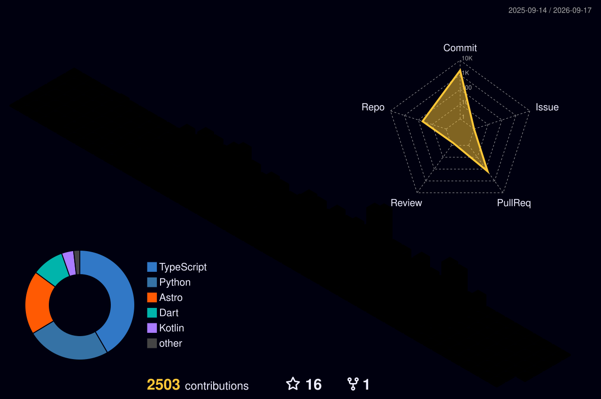

  
  

  

    Building web platforms, admin dashboards, and Flutter Android apps. Growing into AI/ML with Python.
  

  

    
    
    
  

  ---
  

 

 

  <table>
    <tr>
      <td align="center">
        
      </td>
      <td align="center">
        
      </td>
    </tr>
  </table>

 

 

## 🚀 Featured Projects

| Project | Description | Links |
| :--- | :--- | :--- |
| **LexNova Legal Platform** | Web + admin dashboard + Android app for legal services. | [Live](https://lexnovaeu.xyz) • [Code](https://github.com/Shahadat99x/lawfirm-pwa-platform) |
| **EduFriends Global** | Multi-role education consultancy platform (web + Android). | [Live](https://edufriendsglobal.com) • [Code](https://github.com/Shahadat99x/edufriends-global) |
| **EstateNova** | Real estate listings + enquiry/lead capture platform. | [Live](https://estatenova.vercel.app) • [Code](https://github.com/Shahadat99x/real-estate-lead-platform) |

 

## 🛠 Tech Stack

<table>
  <tr>
    <td align="center" width="120">
      
       <b>Frontend</b>
    </td>
    <td align="center" width="120">
      
       <b>Backend</b>
    </td>
    <td align="center" width="120">
      
       <b>Mobile</b>
    </td>
    <td align="center" width="120">
      
       <b>AI / ML</b>
    </td>
    <td align="center" width="120">
      
       <b>DevOps</b>
    </td>
  </tr>
</table>

  

 

## ⚡ What I'm Doing Now

- 🎓 **BSc Applied AI** @ VILNIUS TECH (2023–Present)
- 🔨 **Building:** Full-stack web & Android apps
- 📚 **Learning:** AI/ML foundations in Python, Deep Learning

 

 

 
  <h2>🐍 Contributions</h2>
  
   
  <i>(Note: This 3D City graph will appear once the "GitHub-Profile-3D-Contrib" workflow runs)</i>

 

## 📫 Connect

> "Open to internships, part-time roles, and freelance projects."

  
  
  
  

---

🛠 <b>How to Use This as Your Profile README</b>

 

1.  **Create Profile Repo**: Create a new public repository named `Shahadat99x` (must match your username exactly).
2.  **Copy Files**: Copy `README.md`, `/assets` folder, and `.github/workflows/snake.yml` into that repository.
3.  **Snake Permissions**: 
    - Go to Repo Settings > Actions > General > Workflow permissions.
    - Select "Read and write permissions".
    - Click Save.
4.  **Push**: Commit and push the files.
5.  **Output Branch**: The Snake workflow will run automatically (or manually dispatch it) and create an `output` branch. The README already links to images from that branch.

